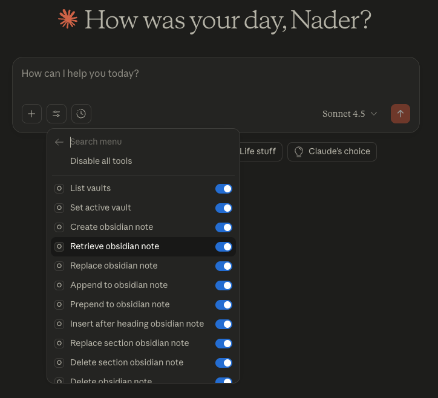
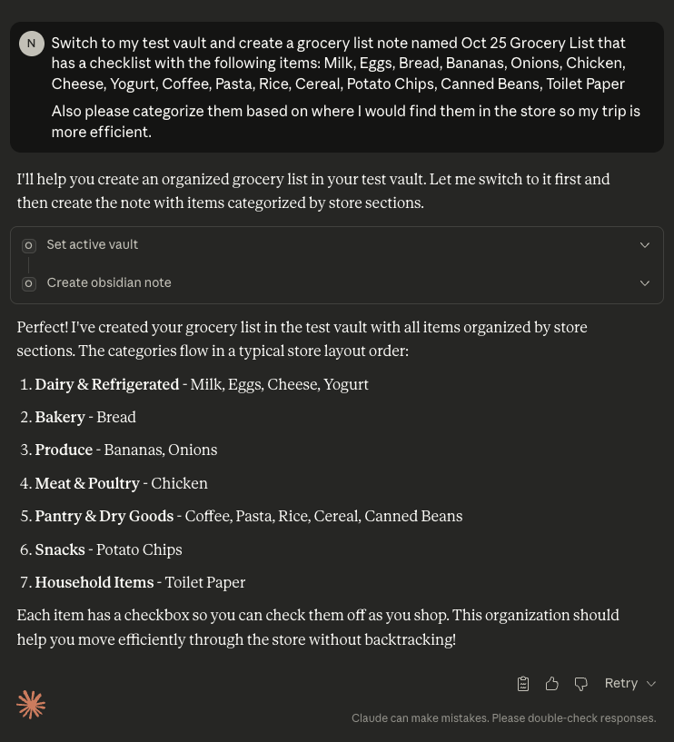
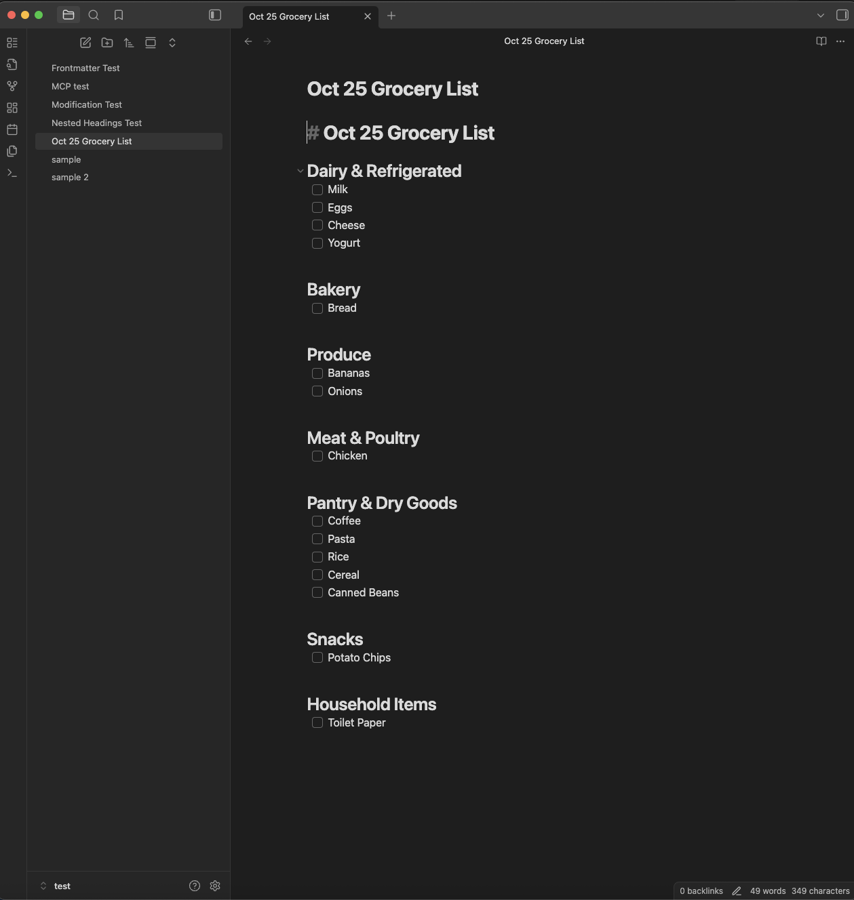

# 🧠 Obsidian MCP Server

**Turn your Obsidian vaults into structured context sources for Claude Desktop**

[](https://www.python.org/downloads/)
[](https://gofastmcp.com/)
[](LICENSE)

> **📚 Technical Deep Dive:** [Read the full development journey](https://nbaradar.github.io/the-latent-space/Personal-Projects/Obsidian-MCP-Server/Obsidian-MCP-Server) — research notes, design decisions, and iteration history.

---

## Why This Exists

Obsidian Vaults are where my knowledge lives. But connecting them to LLMs requires more than just "read file" — you need **vault-aware sessions**, **heading-based navigation**, and **token-efficient search** that doesn't blow your context window.

This MCP server solves that by treating Obsidian vaults as **first-class data sources** for LLMs, with tools designed around how markdown actually works (structure-based, not line-number-based).

---

## ✨ Key Features

### 🗂️ **Multi-Vault Session Management**
- Configure multiple vaults in `vaults.yaml` (personal, work, research, etc.)
- Switch active vault mid-conversation: *"Use my work vault"*
- Session-aware context tracking across tool calls

### 🎯 **Structure-Aware Editing**
Traditional file operations use line numbers. Markdown uses **headings**.

```markdown
## Project Ideas
Some content here

### Idea 1
Details about idea 1

## Resources
Links and references
```

**With this server:**
- `insert_after_heading("Project Ideas")` → Adds content in the right semantic location
- `replace_section("Idea 1")` → Updates just that subsection
- `delete_section("Resources")` → Removes heading + all content until next same-level heading

### 🔍 **Token-Efficient Search**
Searching 10 notes with full content: **~50,000 tokens** 💸  
Searching with contextual snippets: **~1,500 tokens** ✅

```python
# Returns 3 snippets per match, ~200 chars each
search_obsidian_content("MCP server design patterns")
```

Claude gets enough context to understand matches without burning your token budget.

---

## 🚀 Quick Start

### Prerequisites
- Python 3.11+
- [Claude Desktop](https://claude.ai/download)
- One or more Obsidian vaults

### Installation

```bash
# Clone the repository
git clone https://github.com/nbaradar/obsidian-mcp-server.git
cd obsidian-mcp-server

# Install dependencies with uv (recommended)
curl -LsSf https://astral.sh/uv/install.sh | sh
uv venv
source .venv/bin/activate  # On Windows: .venv\Scripts\activate
uv pip install -r requirements.txt
```

### Configuration

1. **Create `vaults.yaml` in the project root:**

```yaml
default: personal
vaults:
  personal:
    path: "/Users/you/Documents/PersonalVault"
    description: "Primary personal vault"
  
  work:
    path: "/Users/you/Documents/WorkVault"
    description: "Work projects and documentation"
```

2. **Add to Claude Desktop config** (`~/Library/Application Support/Claude/claude_desktop_config.json`):

```json
{
  "mcpServers": {
    "obsidian": {
      "command": "/absolute/path/to/.venv/bin/python",
      "args": [
        "/absolute/path/to/obsidian-mcp-server/server.py"
      ]
    }
  }
}
```

3. **Restart Claude Desktop**

You should see "🔌 MCP" in Claude Desktop with your Obsidian tools available.

---

## 🎬 What It Looks Like

Once configured, you'll see your Obsidian tools available in Claude Desktop:





*13 tools available for multi-vault note management with heading-aware operations*

---

## 📖 Usage Examples

### Basic Operations
```
User: "Create a note called 'Project Ideas' in my personal vault"
Claude: [uses create_obsidian_note]

User: "Switch to my work vault and list all notes"
Claude: [uses set_active_vault, then list_obsidian_notes]

User: "Search for notes about 'machine learning'"
Claude: [uses search_obsidian_content for snippets]
```

### Advanced: Structured Editing
```
User: "In my 'Meeting Notes' file, add today's standup under 
       the 'Daily Standups' heading"
Claude: [uses insert_after_heading_obsidian_note]

User: "Replace the 'Action Items' section with..."
Claude: [uses replace_section_obsidian_note]

User: "Add a summary paragraph at the end of 'Project Updates' before any subsections"
Claude: [uses append_to_section_obsidian_note]
```

---

## 🛠️ Available Tools

### **Management**
| Tool | Purpose |
|------|---------|
| `list_vaults` | Discover configured vaults and current session state |
| `set_active_vault` | Switch active vault for subsequent operations |

### **Core Operations**
| Tool | Purpose |
|------|---------|
| `create_obsidian_note` | Create new markdown file |
| `retrieve_obsidian_note` | Read full note contents |
| `replace_obsidian_note` | Overwrite entire file |
| `append_to_obsidian_note` | Add content to end |
| `prepend_to_obsidian_note` | Add content to beginning |
| `delete_obsidian_note` | Remove file |

### **Structured Editing**
| Tool | Purpose |
|------|---------|
| `insert_after_heading_obsidian_note` | Insert content below a heading |
| `append_to_section_obsidian_note` | Append content to a heading’s section before subsections |
| `replace_section_obsidian_note` | Replace content under a heading |
| `delete_section_obsidian_note` | Remove heading and its section |

### **Discovery**
| Tool | Purpose |
|------|---------|
| `list_obsidian_notes` | List all notes in vault |
| `search_obsidian_notes` | Search note titles |
| `search_obsidian_content` | Token-efficient content search |

---

## 🏗️ Design Principles

### 1. **Token Efficiency First**
Every tool is designed to minimize context window usage:
- Snippet-based search over full-content retrieval
- Heading-based navigation over full-file reads
- Combined operations over multiple tool calls

### 2. **Markdown-Native Operations**
Traditional editors use line numbers. This breaks with note edits. **semantic anchors** (headings) remain stable as content changes.

### 3. **Session-Aware Context**
Claude can switch between vaults mid-conversation without losing state.

*"Update my work vault... actually, check my personal vault first"* — just works.

---

## 🗺️ Roadmap

- [x] **v1.0** — Core CRUD operations
- [x] **v1.1** — Token-efficient content search
- [x] **v1.2** — Structured heading-based editing
- [ ] **v1.3** — YAML frontmatter manipulation
- [ ] **v1.4** — Automated tagging based on content
- [ ] **v2.0** — HTTP transport for remote access

See [`AGENTS.md`](./AGENTS.md) for detailed development notes and architecture decisions.

---

## 📚 Documentation

- **[Development Journey](https://nbaradar.github.io/the-latent-space/Personal-Projects/Obsidian-MCP-Server/Obsidian-MCP-Server)** — Full technical writeup with research notes, debugging stories, and design iterations
- **[MCP Overview](https://nbaradar.github.io/the-latent-space/Notes-+-Research/AI-+-ML/Model-Context-Protocol/MCP-Overview)** — My research notes on the Model Context Protocol
- **[Building Your First MCP Server](https://nbaradar.github.io/the-latent-space/Notes-+-Research/AI-+-ML/Model-Context-Protocol/Build-an-MCP-Server)** — Step-by-step guide

---

## 🤝 Contributing

This project is in active development. Contributions, issues, and feature requests are welcome!

**Particularly interested in:**
- Testing on Windows/Linux (currently Mac-focused)
- Additional vault sources (Notion, Roam, etc.)
- Performance optimization for large vaults (10k+ notes)

---

## 📄 License

MIT License - see [LICENSE](LICENSE) for details.

---

## 🙏 Acknowledgments

Built with:
- [FastMCP](https://gofastmcp.com/) by Anthropic
- [Model Context Protocol](https://modelcontextprotocol.io/) specification
- Inspiration from the Obsidian community's API work

---

## 📬 Contact

**Nader Baradar**
- GitHub: [@nbaradar](https://github.com/nbaradar)
- Blog: [The Latent Space](https://nbaradar.github.io/the-latent-space/)

---

<p align="center">
  <i>Built because context matters, and Obsidian is where mine lives.</i>
</p>
